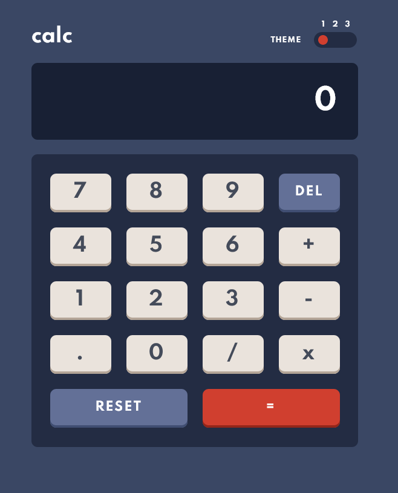
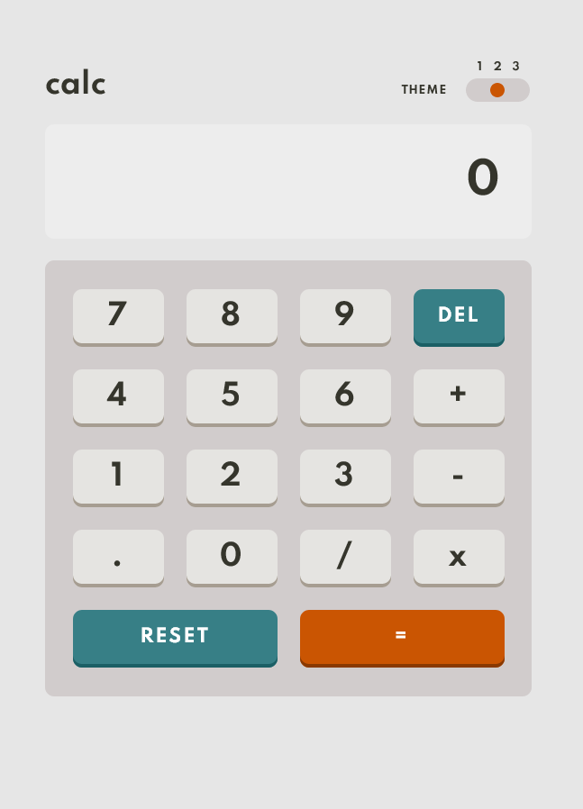
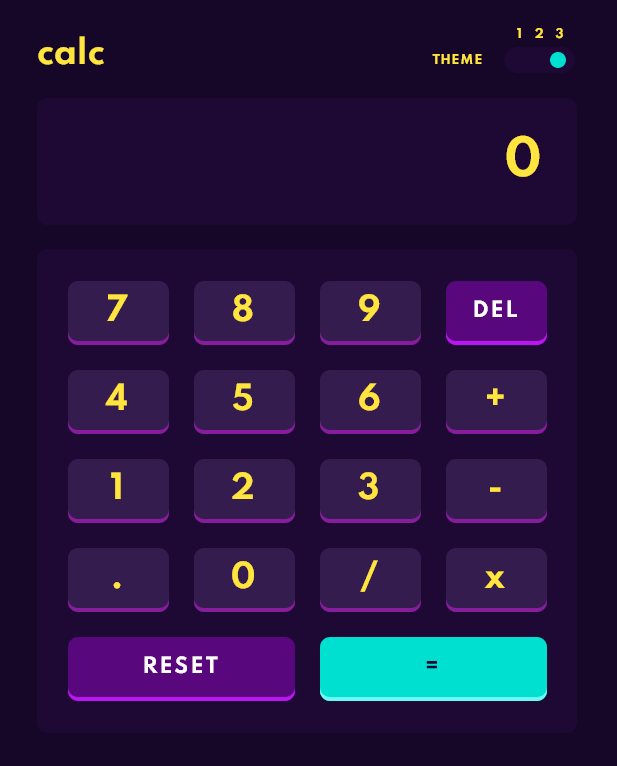

# Frontend Mentor - Calculator app solution

This is a solution to the [Calculator app challenge on Frontend Mentor](https://www.frontendmentor.io/challenges/calculator-app-9lteq5N29). Frontend Mentor challenges help you improve your coding skills by building realistic projects. 

## Table of contents

- [Overview](#overview)
  - [The challenge](#the-challenge)
  - [Screenshot](#screenshot)
  - [Links](#links)
- [My process](#my-process)
  - [Built with](#built-with)
  
- [Author](#author)

## Overview

### The challenge

Users should be able to:

- See the size of the elements adjust based on their device's screen size
- Perform mathmatical operations like addition, subtraction, multiplication, and division
- Adjust the color theme based on their preference
- **Bonus**: Have their initial theme preference checked using `prefers-color-scheme` and have any additional changes saved in the browser

## Theme 1

## Theme 2

## Theme 3

### Links
- Solution URL: [HTML File](https://github.com/astragenius/calculatorApp/blob/main/index.html)
- Solution URL: [SCSS File's](https://github.com/astragenius/calculatorApp/tree/main/app/scss)
- Solution URL: [javascript file](https://github.com/astragenius/calculatorApp/blob/main/app/js/script.js)
- Live Site URL: [Live preview](https://calculator-app-tan.vercel.app/)
#
## My process

### Built with

- Semantic HTML5 markup
- CSS custom properties
- SCSS 
- Flexbox
- CSS Grid
- OOP with Javascript

#
#

- GitHup - [Add your name here](https://github.com/astragenius)
- Frontend Mentor - [@astragenius](https://www.frontendmentor.io/profile/astragenius)

#

